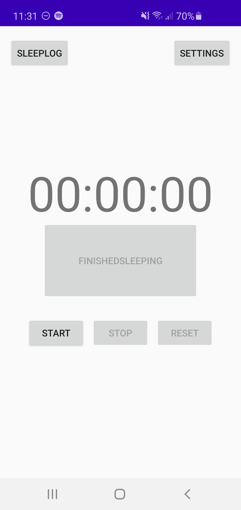
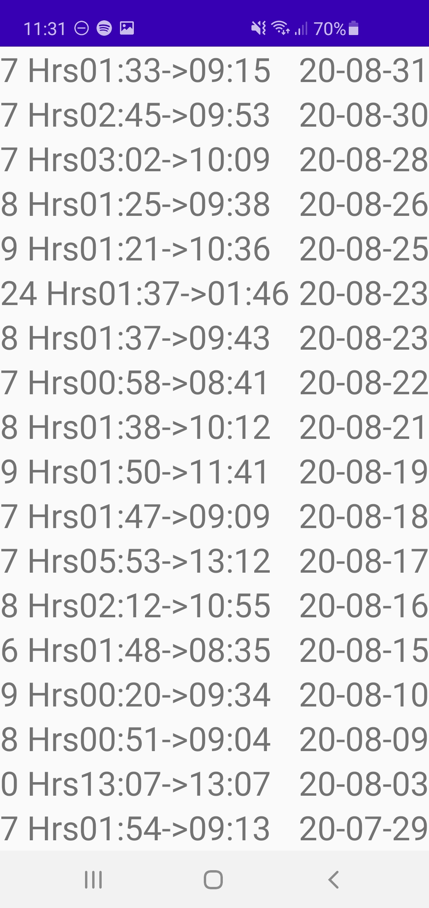

# SleepLog

SleepLog is a barebones android app that tracks and records your sleeping habits

Features to include in order of significance:  
-Removal and manual addition of sleep sessions. 
-Ability to add comments/ratings to reflect on the sleeping experience. 
-Graphing of sleep hours over time and various other visualisations for sleep trends. 
-Google calendar integration. 

Preview of current implementation:

     
